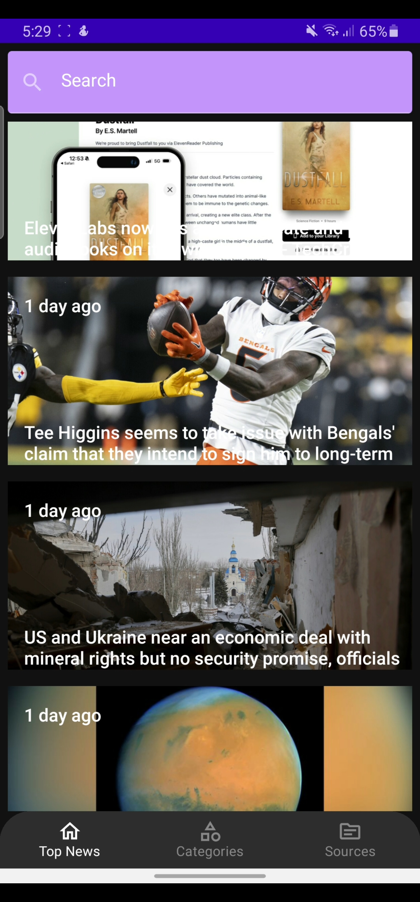
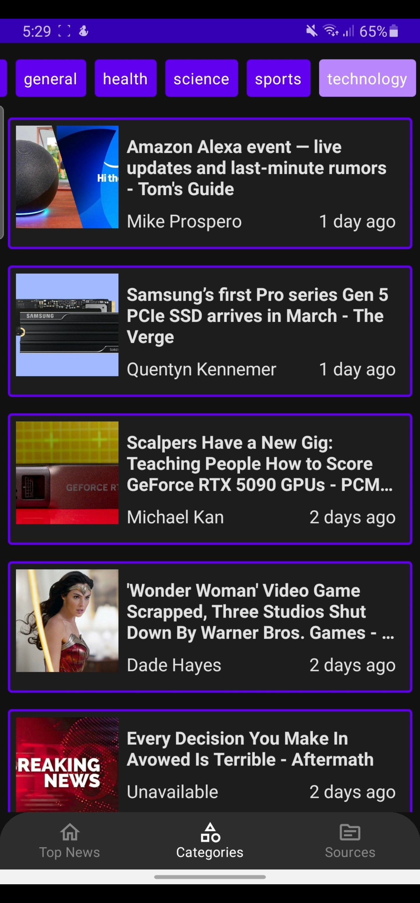
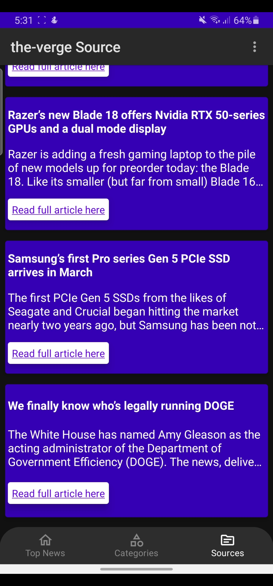
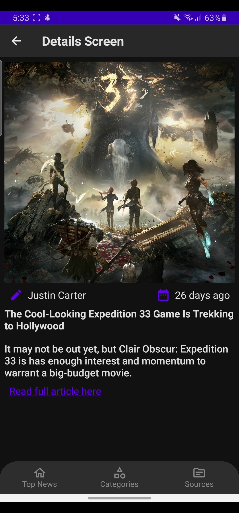
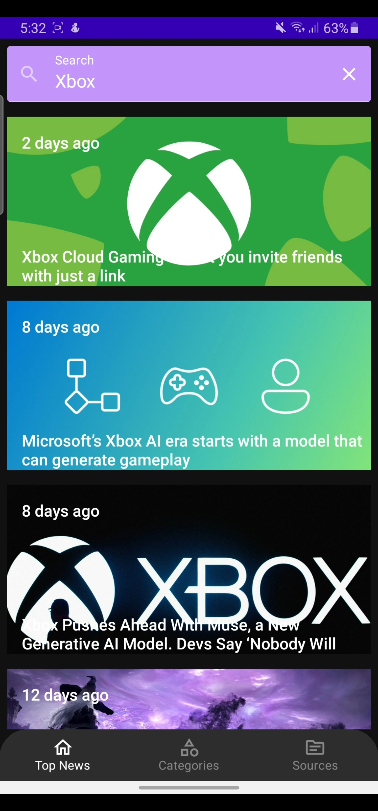

# News-App

**News-App** is a modern Android application designed to deliver up-to-date news from various sources directly to your device. Built with Kotlin and leveraging the power of OpenAPI, the app offers a seamless, intuitive user experience for staying informed on topics you care about.

## Overview

News-App aggregates news articles from trusted sources via OpenAPI, presenting headlines and full stories in a clean, mobile-optimized interface. With features like category filtering, bookmarking, and a customizable feed, users can personalize their news experience for maximum relevance and convenience.

## Key Features

- **Real-time News Updates:** Get the latest headlines as soon as they’re published.
- **Category Filtering:** Easily browse news by categories like Technology, Sports, Business, and more.
- **Search Functionality:** Quickly find news on specific topics or keywords.
- **User-Friendly Interface:** Clean, intuitive design for a great reading experience on Android devices.
- **Customizable Feed:** Personalize your news sources and categories for tailored content.

## Tech Stack

- **Language:** Kotlin
- **Architecture:** MVVM (Model-View-ViewModel)
- **Dependency Injection:** Manual (no DI frameworks)
- **API Integration:** OpenAPI
- **Networking:** Retrofit with Interceptor
- **Image Loading:** Coil
- **JSON Parsing:** Moshi
- **Asynchronous Programming:** Coroutines

## Screenshots

<p align="center">
  
  
  
  
  
</p>

## Getting Started

1. **Clone the repository:**
   ```bash
   git clone https://github.com/MohammedKhudair/News-App.git
   ```
2. **Open in Android Studio:**  
   Open the project folder in Android Studio.

3. **Configure API Keys:**  
   - Register for an API key at your chosen news provider (compatible with OpenAPI).
   - Add your API key as instructed in the app's configuration files.

4. **Build and Run:**  
   Select your device or emulator and run the app.

## Contributing

Contributions are welcome! Feel free to submit issues or pull requests for new features, bug fixes, or improvements.

## License

This project is licensed under the [MIT License](LICENSE).

---

*Stay informed, stay ahead — with News-App!*
